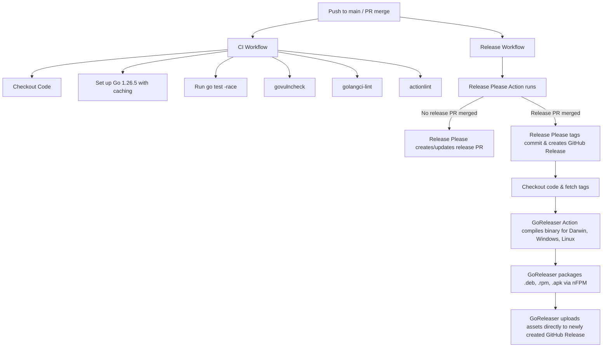

# Implementation Plan - CI/CD & Automated Release Setup

> [!NOTE]
> All configuration files and code changes have been successfully implemented and verified locally. The codebase is clean, tested, and linted.

## CI/CD and Release Workflow Architecture

## Summary of Implemented Changes

1. **Application Version Support**:
   - Updated [main.go](cmd/ghspector/main.go) to declare global variables for version, commit, and date.
   - Added support for `-v` and `-version` command-line flags.

2. **Dependabot Configuration**:
   - Created [.github/dependabot.yml](.github/dependabot.yml) with weekly schedules, prefix `fix(deps)`, and grouped dependency configurations for `gomod` and `github-actions`.

3. **CI Workflow**:
   - Created [.github/workflows/ci.yml](.github/workflows/ci.yml).
   - Runs tests, `govulncheck`, `golangci-lint`, and `actionlint` with pinned action commit SHAs.

4. **Release-Please Configuration**:
   - Created [release-please-config.json](release-please-config.json) setting initial version to `0.0.1` and release-type to `go`.
   - Seeded [.release-please-manifest.json](.release-please-manifest.json) at `0.0.0` so the first release is exactly `0.0.1`.

5. **Release Workflow**:
   - Created [.github/workflows/release.yml](.github/workflows/release.yml).
   - Configured `release-please` and `goreleaser` running sequentially in a single workflow using the default `secrets.GITHUB_TOKEN`. This prevents the need for any administrative PATs or GitHub Apps.

6. **GoReleaser Configuration**:
   - Updated [.goreleaser.yaml](.goreleaser.yaml) to version 2 standards, fixing deprecation warnings.
   - Configured the `nfpms` block to generate `.deb`, `.rpm`, and `.apk` packages using `Yoan-Alexander Grigorov` as maintainer with MIT license.

7. **Vulnerability Mitigation & Security**:
   - Upgraded Go minimum toolchain directive in [go.mod](go.mod) to `1.26.5` which completely resolves all standard library vulnerability reports.
   - Upgraded `golang.org/x/net` to `v0.57.0` and `github.com/yuin/goldmark` to `v1.7.17` to fix all dependency security alerts.
   - Ran `govulncheck ./...` and confirmed **0 vulnerabilities remain**.

8. **Readme & Documentation**:
   - Updated [README.md](README.md) to add precise, platform-specific installation instructions (direct binaries, `.deb`, `.rpm`, `.apk`, and `go install`).

---

## How the First Release (`0.0.1`) Will Happen

Once the branch `chore/release-setup` is merged to `main` and pushed to your remote origin:
1. The **Release** workflow will trigger.
2. Because no release PR exists yet, `release-please` will automatically generate a **Release PR** (e.g. `chore: release 0.0.1`).
3. You will merge that Release PR into `main`.
4. Merging the Release PR triggers the **Release** workflow again.
5. This time, `release-please` sees the merged PR, creates the GitHub Release tag `v0.0.1`, and sets `release_created=true`.
6. GoReleaser runs, compiles the binaries, packages the `.deb`, `.rpm`, and `.apk` files, and uploads all assets to the `v0.0.1` release.
